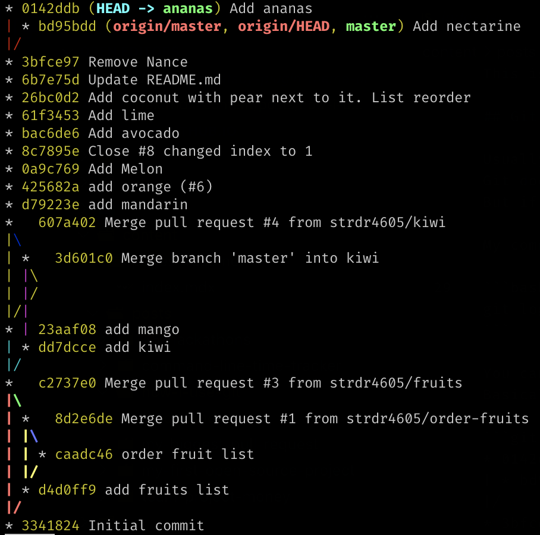

Nowadays almost every software engineer is using Git as a version control system for their projects.
There are a lot of GUI apps for working with Git, also integrations with IDEs and text editors.
I know engineers that are using Git only from their IDE. But no matter what, one day you have to use Git from the command line.

When I started using Git the first time I used it from the command line and at the beginning, I felt like a cool engineer working with the terminal.
So I decided to stick with this approach as usually from IDE it's not possible to do everything that Git is capable of.
Maybe a more realistic reason is that I never worked with rich IDEs with support for Git.
Although nowadays I use VSCode and sometimes I reach its integration with Git.

This is not a beginner guide on how to use Git, it's just my daily use of it.
If you are using Git from the command line or trying to switch from GUI to the command line some of these tips may be helpful for you.

## Git history

Usually when I open a project first thing that I do is looking into Git history to see what was done and where I am in the commits history.
Git doesn't have a beautiful way to show the history and many engineers that I know are using GUI to see a clear picture of the history.
But if you don't use Merge commits even a simple `git log` is clear to understand.

My command for showing Git history is:

```bash
git log --oneline --all --graph
```

You can look at what all these arguments do at [git-log docs](https://www.git-scm.com/docs/git-log).
Basically, it prints the history in this format:



I can see my current location **`HEAD`**, also local and remote branches. <br/>
I run `git log --oneline --all --graph` almost every time with other commands that I use.

## Git Aliases vs Ctrl + R

Of course, typing `git log --oneline --all --graph` every time takes a lot of time.
For these cases, people usually set [Git Aliases](https://git-scm.com/book/en/v2/Git-Basics-Git-Aliases).
But this means that you need to configure aliases on every new machine that you work on. You may use [dotfiles](https://dotfiles.github.io).

I got used to doing a search using **Ctrl + R** where I type `gra` and `git log --oneline --all --graph` appears as a last used command.
I also use **Ctrl + R** for any other long command that I need again, so you may consider **Ctrl + R** over Git Aliases.

## Synchronizing with remote

When I start a new task and need to get the latest changes from `master` I do:

```bash
git checkout master # switch to master branch
git fetch origin master # updating origin/master branch
git reset --hard origin/master # reset local (master) branch to much origin/master
```

I know people that do:

```bash
git checkout master # switch to master branch
git pull origin master # does git fetch + git merge
```

But I almost never run this command because I don't want to resolve any conflicts while merging and I don't care about changes in local `master`.
Sometimes I may run `git pull -r origin master` which does `git rebase` instead of `git merge` because I don't like Merge commits.

## Creating a new branch

When working on a new task I create a new branch with:

```bash
git checkout -b feat/4605-new-function
```

In the name of the branch I follow this format <br/>
`<type of task>/<number of ticket>-<short description>`.

## Committing changes

When I am ready to commit a change in the repo, I add my changes to stage phase using:

```bash
git add -A
```

I know that some people are using `git add .` but this command stages only the file from the current folder,
so with you run this command in a child folder changes from the parent folder will be not staged for commit.

### Git Version 2.x

| Command | New Files | Modified Files | Deleted Files | Description |
|-|-|-|-|-|
| `git add -A` | ✔️ | ✔️ | ✔️ | Stage all (new, modified, deleted) files |
| `git add .` | ✔️ | ✔️ | ✔️ | Stage all (new, modified, deleted) files in current folder |

More info [here](https://stackoverflow.com/questions/572549/difference-between-git-add-a-and-git-add).

When committing I use:

```bash
git commit -m "feat: add new function"
```

To write the commit message nowadays I use [Conventional Commits](https://www.conventionalcommits.org/en/v1.0.0-beta.2/) standard.
But to write a good description I try to stick to this approach; [How to Write a Git Commit Message](https://chris.beams.io/posts/git-commit/).

## Amending

If I need to make a change to the previous commit I change the files and run:

```bash
git add -A
git commit --amend --no-edit --no-verify
```

I add `--no-edit` if I want the message to stay the same and `--no-verify` if I am sure of the change and don't want to wait for a long **pre-commit** check to run.
All this using **Ctrl + R** command to search for `ame` text (contains in `--amend`).

## Stashing

If I need to move between branches and have an unfinished work, I run:

```bash
git add -A
git stash
git checkout other-branch 
# do some work on that branch
git checkout wip-branch # come back
git stash pop # applies and remove changes from stash stack
```

If I only need to apply the stash:

```bash
git stash apply
```

But once in a week or so, I clear my stash with:

```bash
git stash drop
```

## Reseting

When I have done some dummy changes and I want to flush every unneeded change I run:

```bash
git reset --hard HEAD
```

## Before Pull Request

Before pushing, I check if there are no changes on the remote `master`. If the `origin/master` branch was updated I need to rebase on the new changes.

```bash
git fetch
git log --oneline --all --graph # inspect any changes, mental preparation for any rebase conflicts
git rebase origin master
git push -u origin feat/4605-new-function
```

Also, I may change the history of the current branch using:

```bash
git rebase -i # Let you edit the history (changing messaging, squashing, ...)
```

## Another useful rebase command

Sometimes I have rebase use cases where I need to use a powerful option of rebase command.
Let's say that I finished a task on branch `topicA` and created a new branch with commits for `topicB`.

Like so:

```text
.
                            H---I---J topicB
                           /
                  E---F---G  topicA
                 /
    A---B---C---D  master
```

Then I realize that `topicB` doesn't rely on changes from `topicA` and I should have started it from `master` branch.

Running `git rebase master` will not change anything because `topicB` is based on `topicA` which itself is based on `master`.
Moving `topicB` to start from `master` I run:

```bash
git rebase --onto master topicA topicB
```

Adding `topicB` is optional if I am already being on `topicB` branch

```text
 .
                 H'--I'--J'  topicB
                /
                | E---F---G  topicA
                |/
    A---B---C---D  master
```

I remember corect command order by <br/>
 `git rebase --onto <new base> <old base>`

More about [Git rebase](https://git-scm.com/docs/git-rebase).

## Clean up remote branches

To remove old "red" branches.

```bash
git remote prune origin # add -n for dry run
```

More options [here](https://www.git-tower.com/learn/git/faq/cleanup-remote-branches-with-git-prune/).

## Commands that I use rarely

I don't use `git merge` that often because I am more used to `git rebase`, but then I need I always use `git merge --ff-only` to not create a Merge commit. <br/>
I used several times `git bisect` to find bugs in a 40 commits range history. <br/>
Also `git reflog` to recover some changes from wrong hard resets or rebases. <br/>

## Conclusion

I am not that good at Git as I wish I was but I know enough to resolve almost any git related problems.
I have friends that use Git in IDE and sometimes they ask me to help to solve a Git use case.
Also I now enough to search and understand any solution for a new Git use case that I encounter.

I will update this post with new changes to my Git usage.
Let me know what other commands do you use often!
